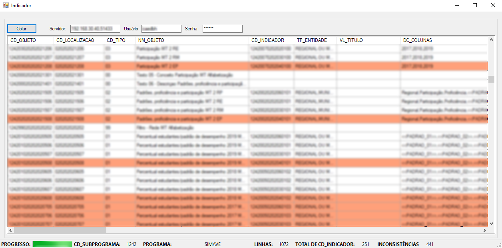
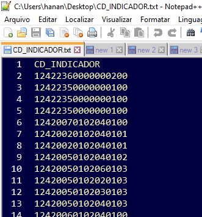

# CAEd Operações: CD_INDICADOR

Ferramentas que efetua a comparação dos códigos de indicadores com os códigos existentes em uma base MSSQL.

# Arquivo que compõe a aplicação

1 - 
```sh
CD_INDICADOR.exe
```

# Codificação: MS Visual Studio C# 

Ferramenta desenvolvida em MS Visual Studio C# para VSTO MSEXCEL.

# Requisitos Mínimos

- Windows 7 ou mais atual.
- MS .NET Framework 4.6.

# Instalação da Aplicação

- Não é necessária a instalação da aplicação apenas executar com permissões de usuário padrão.

```sh
CD_INDICADOR.exe
```



- Executar o arquivo:

```sh
CD_INDICADOR.exe
```

# Utilização da Aplicação

- Selecione e copie toda a planilha ou somentes algumas células e na nesta aplicação clique no botão "Colar" e aguarde o processo "Finalizar". A aplicação vai inserir a planilha e comparar a coluna CD_INDICADOR com CD_INDICADOR da base dados do mesmo projeto.

As linhas coloridas indicam que foram encontradas divergências entre os CD_INDICADOR da planilha e da base de dados.

A barra de status contém as informações sobre o processo realizado.


- Um arquivo com a lista de CD_INDICADOR será criado na área de trabalho.




